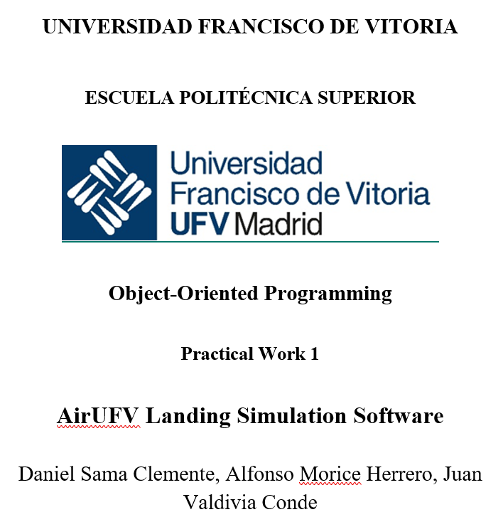

# practical_work_i_oop_-12-

## 1. COVER 

  

## 2. TABLE OF CONTENTS 

- [1. COVER](#1-cover)
- [2. TABLE OF CONTENTS](#2-table-of-contents)
- [3. INTRODUCTION](#3-introduction)
 - [3.1. NAMES OF THE GROUP MEMBERS](#31-names-of-the-group-members)
 - [3.2. SUMMARY OF THE DOCUMENT](#32-summary-of-the-document)
- [4. DESCRIPTION](#4-description)
 - [4.1. PROPOSED SOLUTION](#41-proposed-solution)
 - [4.2. CLASS DIAGRAM](#42-class-diagram)
 - [4.3. DEVELOPMENT COSIDERATIONS](#43-development-cosiderations)
- [5. PROBLEMS & CHALLENGES](#5-problems--challenges)
- [6. CONCLUSIONS](#6-conclusions)
 - [6.1. LESSONS LEARNED](#61-lessons-learned)
 - [6.2. EFFECTIVENESS](#62-effectiveness)
 - [6.3. INSIGHTS GAINED](#63-insights-gained)
- [7. IMPORTANT NOTES](#7-important-notes)
- [8. TIMELINE OF DEVELOPMENT](#8-timeline-of-development) 

## 3. INTRODUCTION 

### 3.1 NAMES OF THE GROUP MEMBERS

    Daniel Sama Clemente
    Alfonso Morice Herrero
    Juan Valvidia Conde 

### 3.2 SUMMARY OF THE DOCUMENT 

## 4. DESCRIPTION 

### 4.1 PROPOSED SOLUTION

### 4.2 CLASS DIAGRAM 

### 4.3 DEVELOPMENT COSIDERATIONS 

- The different considerations must be followed to develop the program:

- The simulator must include al least 2 runways for the airport.

- The program must implement comprehensive input validation to handle errors.

- It is not allowed to use functions like Environment.Exit(0) for ending the program. 

- It is not allowed to use break and continue statements in the loops. You should structure your loops and logic in a way that avoids their necessity, promoting clear and understandable code flow.

## 5. PROBLEMS & CHALLENGES

Creating repo correctly 

Enums 

Load from File 

## 6. CONCLUSIONS 

### 6.1 LESSONS LEARNED 

Powerness of enums, and lists 

### 6.2 EFFECTIVENESS 

### 6.3 INSIGHTS GAINED 

How to use enums

## 7. IMPORTANT NOTES 

It is possible that you see some files in the repository with the name of the repository being 6, this is because there was a problem with the group handling and its members and a new group had to be assigned and our 
group number was changed to 12. The repository was created when we were the group number 6.

## 8. TIMELINE OF DEVELOPMENT 

### 31/03/2025 ###

Created the repo in Github 

Changed the name of the repo to practical_work_i_oop_-6-

Added the files for the programs to the repo.

### 01/04/2025 ###

Renamed folder to repo. 

Renamed .txt file to repo_link file. 

Added repo link to repo_link.txt file 

Moved README.md file to repo folder. 

Added example of .csv file in solution folder.

### 07/04/2025 ### 

Added the files for the classes Aircraft, Airport and Runway. 

Deleted temporary .txt file in the files folder.

Renamed solution file to scr file.

Added the .gitignore file in the files folder.

Added the remaining class files.

Added attributes to clases.

Added comments to the classes.

Added menu to Program class.

Added the State to the Runway class.

Corrected mistakes in the Runway class. 

### 08/04/2025 ### 

Changed the menu to the Airport class. 

Created the instantation for the Airport 

Made changes in the behaviours in the Runway class, (Commit shows as a typo). 

### 10/04/2025 ### 

Added comments in the Program class. 

Added the selection menu on the Airport Class.

### 13/04/2025 ### 

Updated name of project. 

Updated the link in the text-file so it includes the new name. 

### 14/04/2025 ### 

Deleting the Array of Aircrafts and adding a List instead to promote organization. 

Added the loading aircrafts from file method to the menu and also started working on the method itself. 

Finished the method to add new airplanes from a file in the program. 

Added the GetStatus method to Runway class. 

Fixed the LandingAircraft Method in the Runway class. 

Added the ShowStatus method in the Airport class. 

Fixed the ReleaseRunway Method in the Runway class. 

### 15/04/2025 ### 

Added the AdvancedTick method.

Added the method to manually add Airplanes. 

Made a test to make the ticks work for the Runway.

### 16/04/2025 ### 

Added the mehtod for adding new airplanes manually into the main menu. 

Restored the program class.

Fixed Airplane type from file field.

Added the AdvanceTick method in the Runway class.

Added the possibility of adding airplanes manually into the possible options of the main menu. 

Added the call for the advancetick method in the runway class. 

Added comments on the StartSimulattion Selection menu. 

Minor changes made to improve code identation.

### 21/04/2025

Added a minor option in the Select Aircraft Type menu. 

Fixed the sequence of the code in Airport Class.

### 22/04/2025 ###

Added a column in the .csv file for current fuel. 

Fixed an error of instation of the Airport, previously no runways were created. 

Made a change to stop reapeting the same information when the airplanes landed. 

Made an exit for an invalid option in the manual loading method. 

### 23/04/2025 ###

Renamed the method in Runway to RequestRunway. 

Changes in the StartManualSimulation method, control method. 

Added some comments in the Airport class. 

Added a method to control the behaviour of the code when airplanes are being loaded. 

Improved the printing visual of the Airport Status (Airplanes and Runways). 

Added a method to make sure there are no duplicate airplanes with the same ID. 

Added comments on the Airport class. 

Made the Aircraft Class an Abstract Class. 

Added an If statement for the Waiting State in the DefineStateProperties() method. 

### 24/04/2025 ### 

Fixed some comments in Runway class. 

Moved flights_info file to files folder. 

Updated file path. 

Created a readme_files folder inside the files folder for files for the DDD design. 

Fixed typo in the file path in the Airport class. 

Added polymorphism in the Aircraft Class. 

Added Console.Clear() for clarity. 