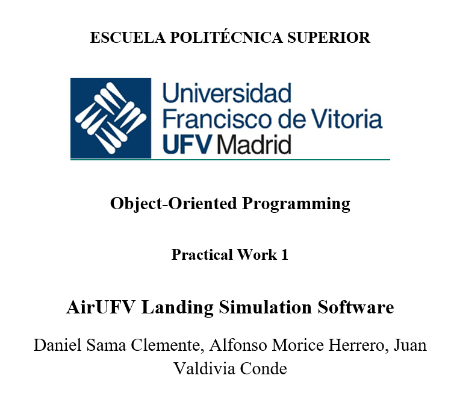

# practical_work_i_oop_-12-

## 1. COVER 

  

## 2. TABLE OF CONTENTS 

- [1. COVER](#1-cover)
- [2. TABLE OF CONTENTS](#2-table-of-contents)
- [3. INTRODUCTION](#3-introduction)
 - [3.1. NAMES OF THE GROUP MEMBERS](#31-names-of-the-group-members)
 - [3.2. SUMMARY OF THE DOCUMENT](#32-summary-of-the-document)
- [4. DESCRIPTION](#4-description)
 - [4.1. PROPOSED SOLUTION](#41-proposed-solution)
 - [4.2. CLASS DIAGRAM](#42-class-diagram)
 - [4.3. DEVELOPMENT COSIDERATIONS](#43-development-cosiderations)
 - [4.4 FURTHER IMPROVEMENTS](#44-further-improvements)
- [5. PROBLEMS & CHALLENGES](#5-problems--challenges)
- [6. CONCLUSIONS](#6-conclusions)
 - [6.1. LESSONS LEARNED](#61-lessons-learned)
 - [6.2. EFFECTIVENESS](#62-effectiveness)
 - [6.3. INSIGHTS GAINED](#63-insights-gained)
- [7. IMPORTANT NOTES](#7-important-notes)
- [8. TIMELINE OF DEVELOPMENT](#8-timeline-of-development) 

## 3. INTRODUCTION 

### 3.1 NAMES OF THE GROUP MEMBERS

    Daniel Sama Clemente
    Alfonso Morice Herrero
    Juan Valvidia Conde 

### 3.2 SUMMARY OF THE DOCUMENT 

This documents shows all of the information regarding on how using OOP principles, a program resembling a Landing Simulation of an airport, was built and developed for the Practical Work 1 of the OOP subject. The program simulates the management of landing aircrafts arriving at an airport.

## 4. DESCRIPTION 

### 4.1 PROPOSED SOLUTION

The program has been developed into 7 classes (with the Program class), in which every class does something spefic. The classes in the program are as they follow: 

**PROGRAM**: This is the entry point of the program, in which the airport in instantiatiated with the initial amount of runways the airport will have and the amount of planes there are in the airport. Then the program is taken to a method in the Airport class which displays a menu for the user. 

**AIRPORT**: This is probably the most important class in the whole program as it instantiates, manages shows and loads aircrafts (either manually or from a file) checks their ID in each case to see if they are no planes with the same ID, instantiates the Runways as well as showing their current status, has all of the methods which interact with the user and their corresponding menus to be printed for the user to select various options of the simulation and also is in charge of advacing the ticks(unit of time) for all of the time the simulation is being executed. The attributes in this class are as they follow: 

double tickHours = 0,25; -> Tells the amount of hours is each unit of tickHours

private aircraft: List<<Aircraft>> -> Information of the aircrafts arriving at the airport
private runways: Runways[] -> Array for the Runways the airport has 

Composition was used for both the List and the array as in the context of this program Runways can't exist if an airport doesn't (the same thing could be argued vice-verse). As equally important the aircrafts arrive at only one airport where they will be stantioned on the ground. It could also be argued that the point of an airport is to have aircrafts, so an airport with no aircrafts makes no sense. 

**RUNWAYS**: This class manages the whole function of runways, as it assings a specific runway to an aircraft to land, if it is possible, if not it keeps them waiting until there is a chance to land and is also in charge on clearing the runways once an aircraft has finished the full process of landing (3 ticks). The attributes in this class are as they follow: 

string id -> ID of a runway

enum runwayState -> Tells if the Runway is Free or Ocupied

Aircraft: Current Aircraft -> Property, which loads all the information of the aircraft in a runway

int ticksToFree -> Counter which tells how many ticks lasts the process of landing for an aircraft

**AIRCRAFT**: This is an abstract class, it uses the principle of abstraction as each of new aircrafts that will be loaded to the list (arriving at the airport) will either only 1 of the subclasses which will be explained later, thus there is no generic Aircraft created. This class also uses the inheritance principles as it is the superclass of each aircraft created. This class also uses the principle of polymorphism as there is a virtual method which prints the generic characteristics of each aircraft and then the overrides methods in the subclasses print the base method and then their override method. The attributes in this class are as they follow: 

string id -> ID of the aircraft (flight number) 
public AircraftState state -> State of the aircraft (InFlight, Waiting, Landing, OnGround)
public int distance -> Distance of an aircraft to the airport
public int speed -> Speed of an aircraft
public string type -> Type of an aircraft
public double fuelCapacity -> Fuel Capacity of an aircraft 
public double fuelConsumption -> Fuel Comsumption of an aircraft 
public double currentFuel -> Current fuel of an aircraft

**CARGO**: Subclass which inherits from the superclass of Aircraft. It has the override method which prints the extra attribute which only exists with the aircrafts designed for Cargo flights. The attributes from the Superclass are pased down, the unique attributes for this class are as they follow: 

double maxLoad -> Maximum weight of cargo a Cargo Aircraft can carry

**COMMERCIAL**: Subclass which inherits from the superclass of Aircraft. It has the override method which prints the extra attribute which only exists with the aircrafts designed for Commercial flights. The attributes from the Superclass are pased down, the unique attributes for this class are as they follow: 

int numPassengers -> The amount of passengers a Commercial Aircraft can carry. 

**PRIVATE**: Subclass which inherits from the superclass of Aircraft. It has the override method which prints the extra attribute which only exists with the aircrafts designed for Private flights. The attributes from the Superclass are pased down, the unique attributes for this class are as they follow: 

string owner -> The name of the owner of the Private Aircraft 

### 4.2 CLASS DIAGRAM 

### 4.3 DEVELOPMENT COSIDERATIONS 

- The different considerations must be followed to develop the program:

- The simulator must include al least 2 runways for the airport.

- The program must implement comprehensive input validation to handle errors.

- It is not allowed to use functions like Environment.Exit(0) for ending the program. 

- It is not allowed to use break and continue statements in the loops. You should structure your loops and logic in a way that avoids their necessity, promoting clear and understandable code flow.

## 5. PROBLEMS & CHALLENGES

The creation of the repo is something is was a bit difficult given that first we needed to create the repository in GitHub as we didn't remember exactly how to make it directly with VS Code, then we cloned it to a special folder from where I created a new project in that folder from VS Code, then i pushed it again to make sure now we had a repo with a functioning program. Later the next part was creating the specific folders which also is quite counter-intuitive as the folders can't be black otherwise they are not recognised by git. 

The enums was a new thing for us as we had had never seen it before, it thought it was somethinig to do with having to define attributes inside an attribute, or something similar to an array. Luckily we search online as saw that it was much simplier that it sounded, it is just like an attribute with certain possible values or string, like a bool but with more options. 

The next thing that was a challenge was on how to assingn an aircraft from the List to a certain runway. This was probably the biggest challenge we faced, as so far we didn't remember on how to do this from a year prior, fortunately by searching online and going back through the slides we noticed that there was something called a Property which is able to store all of the properties of an object, so we defined a Property in the Runway class and we assigned to to an aircraft which was sent from the Airport class. That way a runway had a aircraft assigned when it was landing. 

Finally, our last challenge, was on how to load from a file, the specific information from an aircraft and also depending on its type it needed to be instantiated in a specific type, naturally we remembered we did something similar 1 year ago when we also had to load information from a file and also we had to compare the types they were, so we went back an saw the syntax we used and based on that we modified and implement that syntax into our code.  

## 6. CONCLUSIONS 

### 6.1 LESSONS LEARNED 

Once lesson that we have learned is how porwerfull the enums have been to do this project not only because it is a variable, which also makes it easier, but also because when using them in method they autodefine themselves when typing and they save a lot of time when programming and also they enhance clearness to both the user and the developer. 

Another thing which we have learned is how efficient also the List tool, it is like creating a database but where multiple object of subclases can be stored there and later with a foreach loop can be reached, all of them without any problems or difficulties. 

### 6.2 EFFECTIVENESS 

We can say that this program now complies with the given requirements of the Practical Work 1. Where it correctly simulates the landings of arriving aircrafts using the principles of OOP. 

We can also say that we have maybe gone a step over as we have thought and implement various behaviours to avoid erros and apply a realistic process. For example 

 - No same aircraft ID 
 - When a plane is loaded OnGround its speed and distance are automatically 0. 
 - When a plane is loaded Waiting or Landing it applies the same process of requesting a runway if it is free and if not assigning it to Waiting. 
 - Also we have done catch exceptions to control any common errors that may arise like format exception, unexisting options, null inputs or format errors.

### 6.3 INSIGHTS GAINED 

As said before, insights we have learned is overall how to use the enums and how powerful and efficient they can be not only for being clear and simple, but also because they are easy to create and when programming how they can reduce time. 

Another thing we could say is that as we were advancing with the planning and the creation of the project we have also realized how and where to implement the principles of OOP (Polymorphism, Abstraction, Encapsulation and Inheritance), we knew about inheritance but now we have seen where the others happens and why they happen.  

## 7. IMPORTANT NOTES 

It is possible that you see some files in the repository with the name of the repository being 6, this is because there was a problem with the group handling and its members and a new group had to be assigned and our 
group number was changed to 12. The repository was created when we were the group number 6. 

## 8. TIMELINE OF DEVELOPMENT 

### 31/03/2025 ###

Created the repo in Github 

Changed the name of the repo to practical_work_i_oop_-6-

Added the files for the programs to the repo.

### 01/04/2025 ###

Renamed folder to repo. 

Renamed .txt file to repo_link file. 

Added repo link to repo_link.txt file 

Moved README.md file to repo folder. 

Added example of .csv file in solution folder.

### 07/04/2025 ### 

Added the files for the classes Aircraft, Airport and Runway. 

Deleted temporary .txt file in the files folder.

Renamed solution file to scr file.

Added the .gitignore file in the files folder.

Added the remaining class files.

Added attributes to clases.

Added comments to the classes.

Added menu to Program class.

Added the State to the Runway class.

Corrected mistakes in the Runway class. 

### 08/04/2025 ### 

Changed the menu to the Airport class. 

Created the instantation for the Airport 

Made changes in the behaviours in the Runway class, (Commit shows as a typo). 

### 10/04/2025 ### 

Added comments in the Program class. 

Added the selection menu on the Airport Class.

### 13/04/2025 ### 

Updated name of project. 

Updated the link in the text-file so it includes the new name. 

### 14/04/2025 ### 

Deleting the Array of Aircrafts and adding a List instead to promote organization. 

Added the loading aircrafts from file method to the menu and also started working on the method itself. 

Finished the method to add new airplanes from a file in the program. 

Added the GetStatus method to Runway class. 

Fixed the LandingAircraft Method in the Runway class. 

Added the ShowStatus method in the Airport class. 

Fixed the ReleaseRunway Method in the Runway class. 

### 15/04/2025 ### 

Added the AdvancedTick method.

Added the method to manually add Airplanes. 

Made a test to make the ticks work for the Runway.

### 16/04/2025 ### 

Added the mehtod for adding new airplanes manually into the main menu. 

Restored the program class.

Fixed Airplane type from file field.

Added the AdvanceTick method in the Runway class.

Added the possibility of adding airplanes manually into the possible options of the main menu. 

Added the call for the advancetick method in the runway class. 

Added comments on the StartSimulattion Selection menu. 

Minor changes made to improve code identation.

### 21/04/2025

Added a minor option in the Select Aircraft Type menu. 

Fixed the sequence of the code in Airport Class.

### 22/04/2025 ###

Added a column in the .csv file for current fuel. 

Fixed an error of instation of the Airport, previously no runways were created. 

Made a change to stop reapeting the same information when the airplanes landed. 

Made an exit for an invalid option in the manual loading method. 

### 23/04/2025 ###

Renamed the method in Runway to RequestRunway. 

Changes in the StartManualSimulation method, control method. 

Added some comments in the Airport class. 

Added a method to control the behaviour of the code when airplanes are being loaded. 

Improved the printing visual of the Airport Status (Airplanes and Runways). 

Added a method to make sure there are no duplicate airplanes with the same ID. 

Added comments on the Airport class. 

Made the Aircraft Class an Abstract Class. 

Added an If statement for the Waiting State in the DefineStateProperties() method. 

### 24/04/2025 ### 

Fixed some comments in Runway class. 

Moved flights_info file to files folder. 

Updated file path. 

Created a readme_files folder inside the files folder for files for the DDD design. 

Fixed typo in the file path in the Airport class. 

Added polymorphism in the Aircraft Class. 

Added Console.Clear() for clarity. 